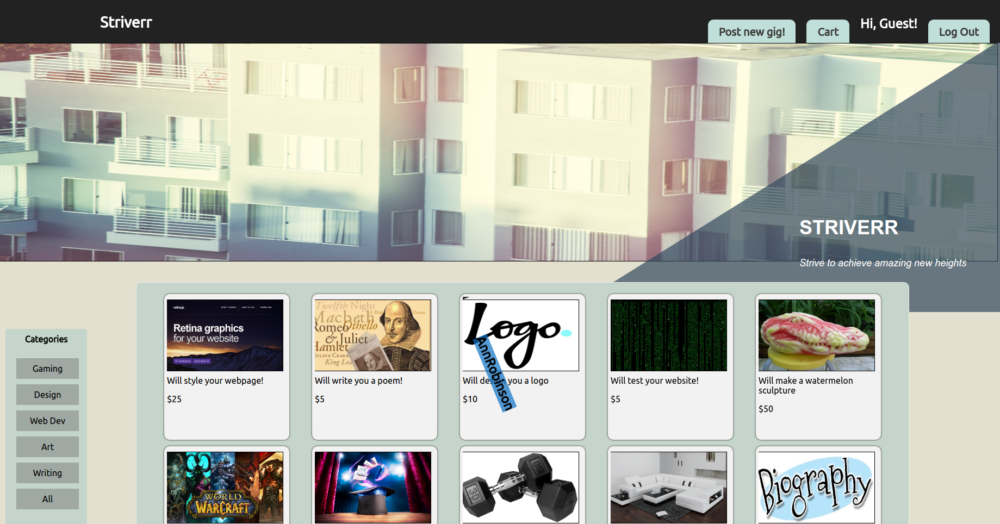
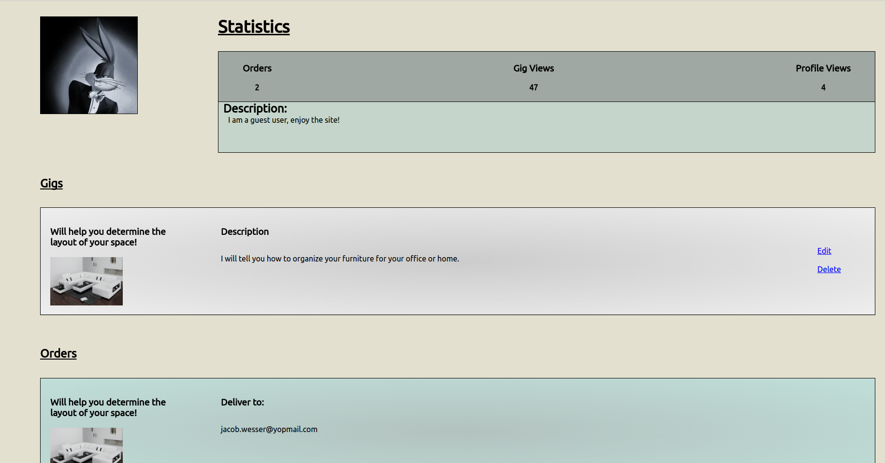
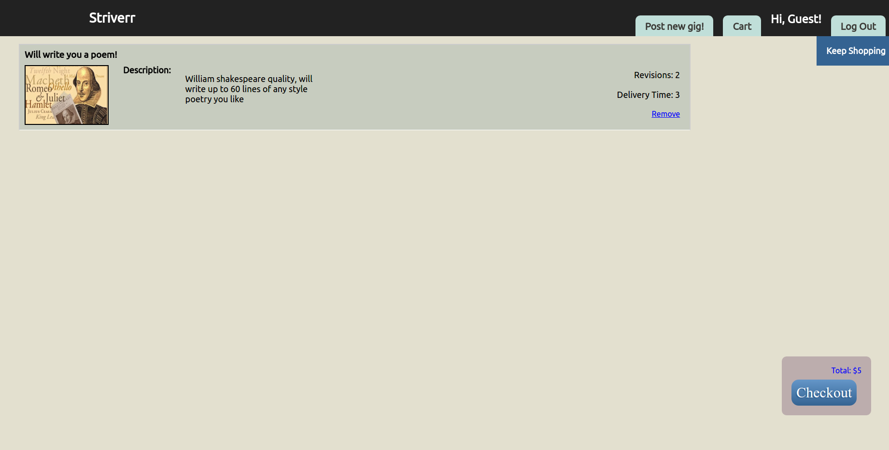

# Striver
[Striverr live](www.striverr.com)

Striverr is a domain that allows users to post gigs (voice overs, web design, etc.) along with their qualifications. Other users can then browse these gigs in order to discover the service they need. The idea was inspired by www.fiverr.com. It utilizes Ruby on Rails on the backend, a PostgreSQL database, and React.js with a Redux architectural framework on the frontend.

## Features & Implementation

### Posting gigs

The site allows you to create a gig for others to discover and purchase. Gigs have a title, description, photo url, revisions, price and category. It requires the user to be logged in. Once the gig has been created it is associated with the user on the back end where it keeps track of the number of views it receives and appears on the users dashboard.

Gigs can then be edited or deleted by the user that posted them from the user dashboard which will remove the gig from the database. The gig will then no longer appear on the index page.

### Filtering

The browse landing page has a navigation bar with categories. Clicking the nav bar filters gigs on the home page to only show those that belong to that specific category for easier browsing.

### User dashboard

The user can view their own dashboard as well as others. The dashboard provides statistics for the number of profile views a user has, the number of views the user has on their gigs, and how many orders the user has had.

The dashboard also shows which gigs the user has posted. Viewing their own dashboard page also shows  the user what gigs of theirs have been ordered and the email of the buyer.

### Viewing gigs

Viewing a gig diplays a semi-transparent modal. The modal displays the gigs information as well as the sellers information. There are also reviews and ratings displayed for the item. The user can then place an order for the gig which will add the item to their cart.

### Cart

The carts page displays all the items the user has selected, and the user has the option to remove those items, keep shopping, or checkout. The total price of all the items are also displayed.

Once the user checksout the seller if notified on their dashboard of the order along with the buyers email address and the cart is cleared out.

## Further Implementations

### confirmations

An additional feature I would like to implement is notifying the seller by email that a purchase has been made and sending a confirmation to the buyer.

### woo commerce

In the future I hope to allow users to actually provide access for users to take part in transactions. I would like to link the site up to allow billing information to be added.
